## Setting Up Jenkins
1. **Install Jenkins**:
   - Set up a Jenkins server on an EC2 instance (e.g., t2.large).
   - Use the following command to retrieve the initial admin password:
     ```bash
     cat /var/lib/jenkins/secrets/initialAdminPassword
     ```

2. **Log into Jenkins**:
   - Navigate to the Jenkins admin page.
   - Enter the username `Jenkins` and the password retrieved in Step 1.

3. **Create a New Pipeline**:
   - Click on "New Item" on the Jenkins home page.
   - Select "Pipeline" as the project type.

4. **Configure the Pipeline**:
   - Add a general description.
   - Set up the "Discard old builds" section.
   - Define the pipeline:
     - **SCM**: Git
     - **Repository URL**: `https://github.com/khannashiv/Jenkins-Practice`
     - **Branches to build**: Specify the branch name.
     - **Script Path**: Path to your `Jenkinsfile`.
     - Add required plugins such as **Git plugin**, **Docker pipeline**, **SonarQube Scanner** used in this project.
     - Configure credentials for **Git**, **SonarQube**, and **Docker** for authentication purposes.

    - 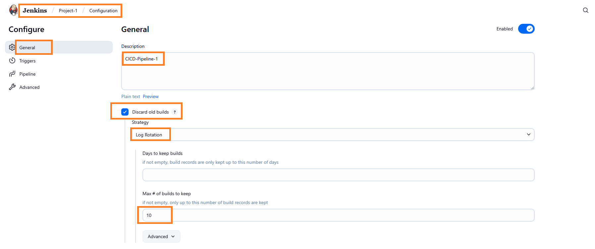
    - 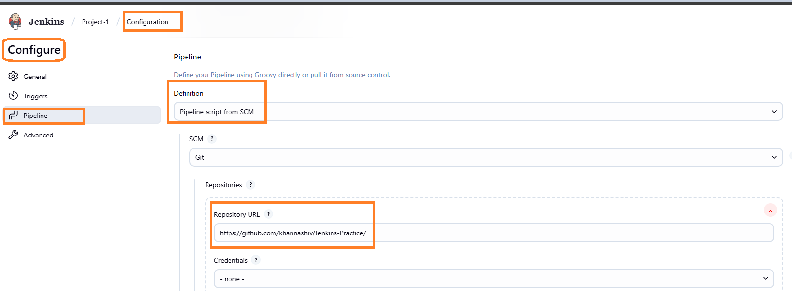
    - 
    - 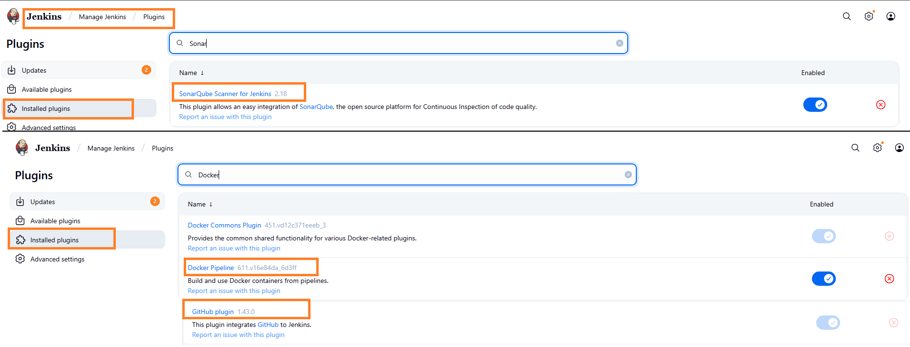
    - 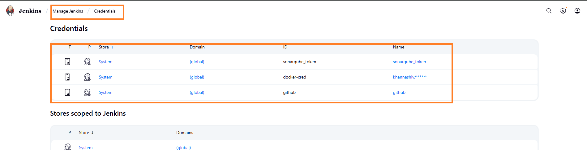

## Configuring the Pipeline

- **Jenkinsfile**: Add the pipeline script in a file named `JenkinsFile` at the git repository whose absolute path is Jenkins-Practice/Project-1/java-maven-sonar-argocd-helm-k8s/spring-boot-app/JenkinsFile. Below we are explaining each code block which is part of Jenkins pipeine.

   ```groovy
   pipeline {

       agent {
           docker {
               image 'khannashiv/maven-shiv-docker-agent:v1'
               args '--user root -v /var/run/docker.sock:/var/run/docker.sock'
           }
       }
   }
   ```

<!-- Explanation of the agent block above:
    - pipeline { ... }
        This declares a Declarative Pipeline, the modern and more structured way to define Jenkins pipelines.
        - `agent`: Specifies where and how Jenkins should run the pipeline or specific stages.
            - `docker`: Indicates the pipeline will run inside a Docker container.
                - `image`: Specifies the Docker image (`khannashiv/maven-shiv-docker-agent:v1`) to use.
                    - Jenkins will:
                        - Pull this image from Docker Hub (or another registry) if it's not already on the system (i.e. if not present on Jenkins Node.)
                        - Start a container using this image to run the pipeline steps.
                        - This image probably includes Maven, Java, and other tools needed for building Java projects.
                - `args`: Provides additional arguments to the Docker container:
                - `--user root`: Runs the container as the root user.
                - `-v /var/run/docker.sock:/var/run/docker.sock`: Mounts the host's Docker socket into the container, allowing Docker commands inside the container to interact with the host's Docker daemon.

- Summary of this code block
    - This pipeline block configures Jenkins to run all build steps inside a custom Docker container with root access and Docker control, which is useful for Maven-based projects that also need to build or run Docker images.

Q: How Jenkins Gets the Docker Image ?

Sol :
1. Jenkins uses the local Docker engine on the agent node (where the pipeline runs).The Docker agent is required on that node for this to work.

2.Image Lookup and Pulling.
    -- Jenkins instructs Docker to run the image khannashiv/maven-shiv-docker-agent:v1.
    -- Docker checks if that image is already present locally.
    -- If the image is not found locally, Docker will:
        . Attempt to pull it from Docker Hub (since no private registry or credentials were specified).
        . This assumes khannashiv/maven-shiv-docker-agent:v1 is publicly available on Docker Hub.
3. Execution
    -- Once the image is pulled (or found locally), Docker spins up a container using that image.
    -- Jenkins executes all pipeline steps inside that container, with root access and the host’s Docker socket mounted.

Prerequisites for this to Work .
    The Jenkins agent must:
        . Have Docker installed and running.
        . Be able to pull images from Docker Hub.
        . Have permissions to run Docker containers (Jenkins user is often part of the docker group).
-->

   ```groovy
   options {
       skipDefaultCheckout(true)
       buildDiscarder(logRotator(numToKeepStr: '10'))
   }
   ```

<!-- Explanation of the options block mentioned above .

- `skipDefaultCheckout(true)`: Prevents Jenkins from automatically checking out the repository source code at the start of the pipeline. This is useful for custom checkouts and avoiding permission issues.
- `buildDiscarder(logRotator(numToKeepStr: '10'))`: Configures Jenkins to retain only the last 10 builds, automatically discarding older build logs to save disk space.
- skipDefaultCheckout(true) and buildDiscarder(logRotator(...)) are built-in features provided by Jenkins for use in Declarative Pipelines.

-->

   ```groovy
   stages {

       stage('Clean Workspace & Fix Permissions') {
           steps {
               sh '''
               echo "Cleaning workspace and fixing permissions..."
               rm -rf ${WORKSPACE}/*
               mkdir -p ${WORKSPACE}
               chown -R 111:113 ${WORKSPACE}
               '''
           }
       }
   }
   ```
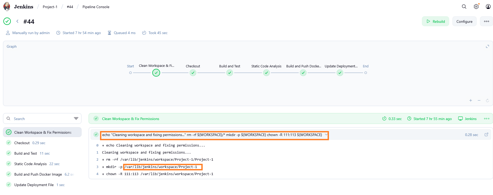

<!-- Explanation of the 'Clean Workspace & Fix Permissions' stage:

This stage ensures a clean workspace by removing old files and resetting permissions to avoid conflicts in subsequent stages.
- echo "Cleaning workspace and fixing permissions..."
    . Prints a message to the Jenkins console log for visibility.
- rm -rf ${WORKSPACE}/*
    . Deletes everything inside the Jenkins workspace directory.
- ${WORKSPACE} is a built-in Jenkins environment variable pointing to the job’s working directory. In this case path of this env variable is : /var/lib/jenkins/workspace/Project-1 ( Refer snap for this stage .)
- rf means:
    r: recursive (delete directories and contents)
    f: force (ignore non-existent files, don’t prompt)
- mkdir -p ${WORKSPACE}
    . Recreates the workspace directory if needed.
    . -p ensures no error is thrown if it already exists.
- chown -R 111:113 ${WORKSPACE}
    . Changes the ownership of the workspace directory to user ID 111 (Jenkins) and group ID 113 (Jenkins).
    . -R: recursive, applies to all files and subdirectories.
- Purpose of this Stage:
        -- Ensures a clean build environment.
        -- Resolves file permission issues, especially in Docker-based builds where user IDs in the container and host differ.
        -- Prevents problems from leftover files of previous builds.
-->

   ```groovy
   stages {

    stage('Checkout') {
        steps {
            checkout([
            $class: 'GitSCM',
            branches: [[name: '*/main']],
            userRemoteConfigs: [[
                url: 'https://github.com/khannashiv/Jenkins-Practice.git',
                credentialsId: 'github'
            ]]
            ])
        }
        }
   }
   ```


<!-- Explanation of the 'Checkout' stage .

-- stage('Checkout') : Defines a stage in the pipeline called "Checkout", where source code retrieval occurs.
    -- steps { ... } : Contains the commands to be executed during this stage.
        -- checkout([ ... ]) : Invokes a manual Git checkout using Jenkins' internal Git plugin (GitSCM class).
            . $class: 'GitSCM' : Tells Jenkins to use the GitSCM (Source Control Manager) plugin for this checkout.
            . branches: [[name: '*/main']] : Specifies the branch to check out.
                */main matches the main branch regardless of the remote name (origin/main, etc.).
            . userRemoteConfigs: [[ ... ]] : Defines where to pull the source code from and what credentials to use: url: 'https://github.com/khannashiv/Jenkins-Practice.git' -- > The GitHub repository URL.
            . credentialsId: 'github' : The ID of credentials stored in Jenkins (in Manage Jenkins > Credentials).
                - This is mainly used for authenticated access to private repositories.
                - This ID must match the one we've configured in Jenkins (e.g., personal access token or classic token).
-->

   ```groovy
   stages {
        stage('Build and Test') {
            steps {
        sh 'ls -ltr'
        sh 'cd Project-1/java-maven-sonar-argocd-helm-k8s/spring-boot-app && mvn clean package'
      }
    }
   }
   ```
   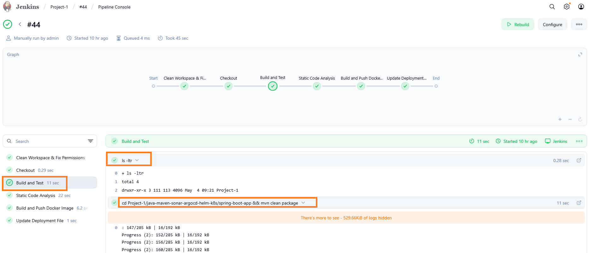
   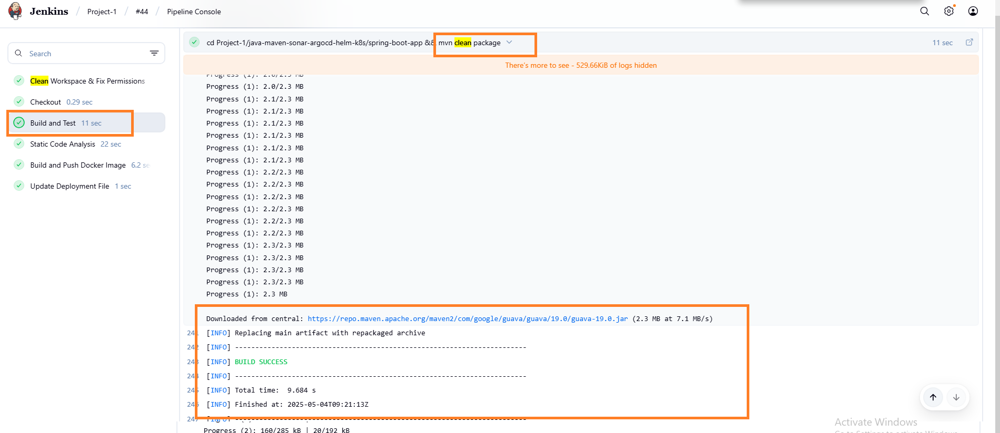

   <!-- Explanation of the 'Explanation of the 'Build & Test' stage .

    -- sh 'ls -ltr' : Lists all files and directories in the current Jenkins workspace directory .
    -- sh 'cd Project-1/java-maven-sonar-argocd-helm-k8s/spring-boot-app && mvn clean package'
        -- Changes into the following nested directory i.e. Project-1/java-maven-sonar-argocd-helm-k8s/spring-boot-app
        -- Then runs:
                -- mvn clean: Deletes previously compiled files and the target directory (ensures a clean build).
                -- mvn package: Compiles the code, runs unit tests, and packages the application into a .jar or .war, based on your pom.xml

    Q :What Must Be true for this stage to Work ?
    Sol : 
        . The path Project-1/java-maven-sonar-argocd-helm-k8s/spring-boot-app must exist in the Jenkins workspace (i.e., it was checked out correctly).
        . Maven (mvn) must be installed and available in the environment or Docker container.
        . The directory must contain a valid pom.xml.
-->

  ```groovy
   stages {

        stage('Static Code Analysis') {
            environment {
            SONAR_URL = "http://3.87.39.73:9000"
        }
            steps {
                withCredentials([string(credentialsId: 'sonarqube_token', variable: 'SONAR_AUTH_TOKEN')]) {
                sh 'cd Project-1/java-maven-sonar-argocd-helm-k8s/spring-boot-app && mvn sonar:sonar -Dsonar.login=$SONAR_AUTH_TOKEN -Dsonar.host.url=${SONAR_URL}'
                }
            }
    }
   }
   ```

   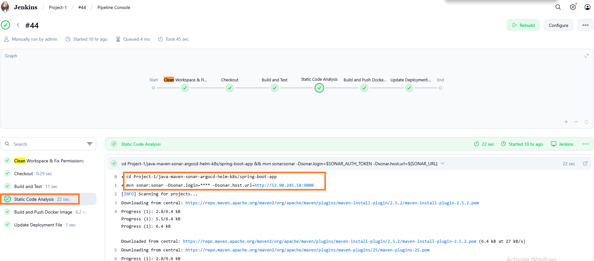
   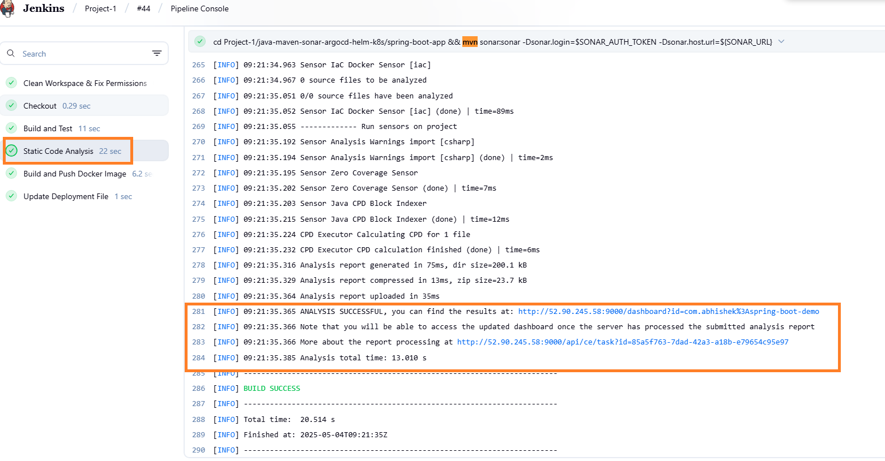
   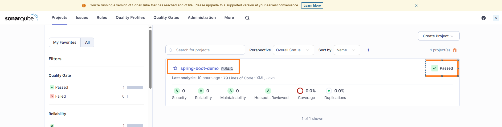
   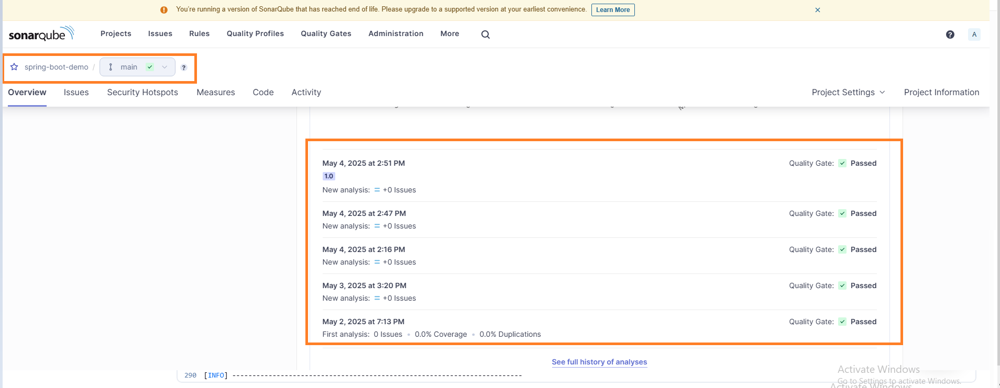

<!-- Explanation of the 'Static Code Analysis' stage .

 -- stage('Static Code Analysis') : Defines a pipeline stage named "Static Code Analysis".
 -- environment { SONAR_URL = "http://3.87.39.73:9000" }
    -- Sets a stage-level environment variable named SONAR_URL.
    -- This is the URL where your SonarQube server is running.
    -- In this case: http://3.87.39.73:9000 (likely an EC2 instance or similar).
-- withCredentials([string(...)])
    -- Securely injects a SonarQube authentication token into the environment.
    -- credentialsId: 'sonarqube_token': Refers to a secret string stored in Jenkins Credentials.
    -- variable: 'SONAR_AUTH_TOKEN': The environment variable Jenkins will use inside the block.
-- Shell Commands :
    -- cd Project-1/java-maven-sonar-argocd-helm-k8s/spring-boot-app && \
    -- mvn sonar:sonar -Dsonar.login=$SONAR_AUTH_TOKEN -Dsonar.host.url=${SONAR_URL}
         # Changes into the Spring Boot app directory.
         # Runs a Maven command to trigger SonarQube analysis with:
            -Dsonar.login=$SONAR_AUTH_TOKEN: uses the secure token for authentication.
            -Dsonar.host.url=${SONAR_URL}: tells Maven where to send analysis results.

Assumptions for this stage to Work.
    .. The project has a valid pom.xml with SonarQube plugin configured.
    .. Jenkins has the SonarQube token stored under the ID sonarqube_token.
    .. Maven and the sonar:sonar goal are available.
    .. The SonarQube server (http://3.87.39.73:9000) is reachable from Jenkins.
-->

  ```groovy
   stages {

        stage('Build and Push Docker Image') {
            environment {
                DOCKER_IMAGE = "khannashiv/ultimate-cicd:${BUILD_NUMBER}"
                REGISTRY_CREDENTIALS = credentials('docker-cred')
            }
            steps {
                script {
                sh 'cd Project-1/java-maven-sonar-argocd-helm-k8s/spring-boot-app && docker build -t ${DOCKER_IMAGE} .'
                def dockerImage = docker.image("${DOCKER_IMAGE}")
                docker.withRegistry('https://index.docker.io/v1/', "docker-cred") {
                    dockerImage.push()
                }
                }
            }
        }
   }
   ```

 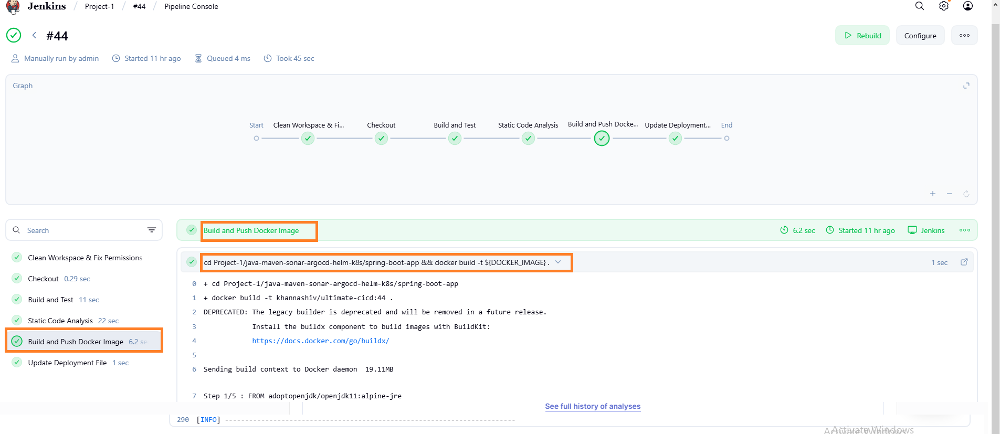
 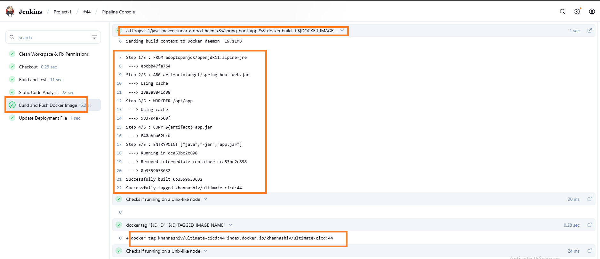
 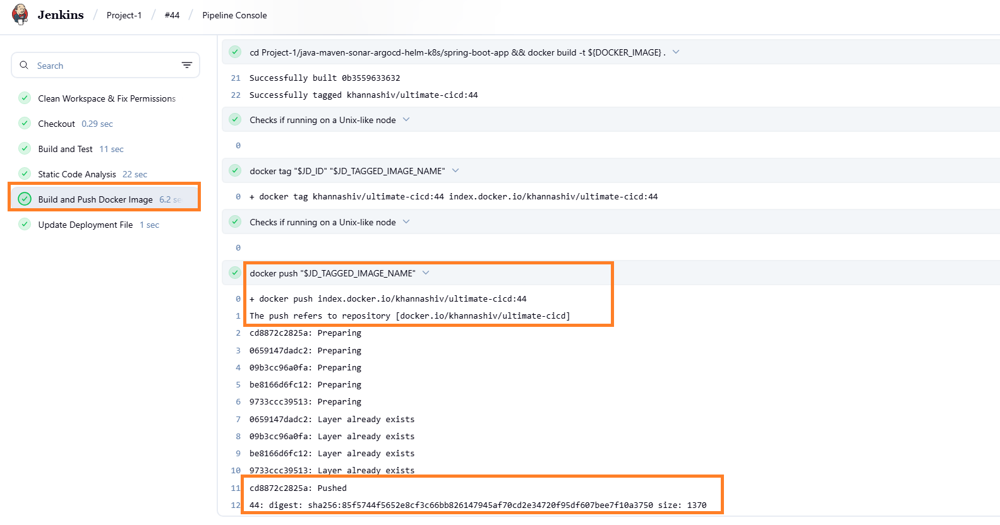
 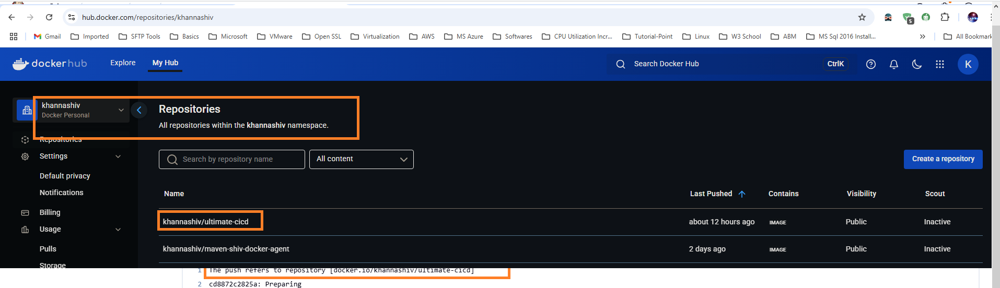
 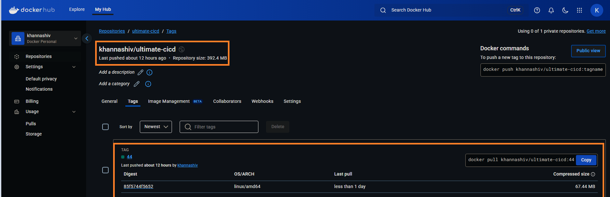
 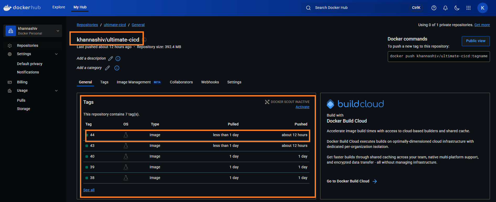

   <!-- Explanation of the 'Build and Push Docker Image' stage .

    -- This stage builds a Docker image from your Java app and pushes it to Docker Hub using credentials stored in Jenkins.
    -- environment { ... }
        Defines environment variables for this stage .
            -- DOCKER_IMAGE = "khannashiv/ultimate-cicd:${BUILD_NUMBER}"
            -- The Docker image name and tag.
            -- Uses the current Jenkins build number as the tag (e.g., khannashiv/ultimate-cicd:44).
            -- REGISTRY_CREDENTIALS = credentials('docker-cred')
            -- Injects Docker Hub credentials stored in Jenkins under the ID docker-cred.
    -- script { ... }
        --  Build Docker image: sh 'cd Project-1/java-maven-sonar-argocd-helm-k8s/spring-boot-app && docker build -t ${DOCKER_IMAGE} .'
            .. Changes into the app directory.
            .. Runs Docker build using the Dockerfile there.
            .. Tags the image as khannashiv/ultimate-cicd:<build_number>.
        --  Prepare Docker image for push: def dockerImage = docker.image("${DOCKER_IMAGE}")
            .. Creates a reference to the built Docker image in Jenkins Docker pipeline DSL.
                .. Meaning of : def dockerImage = docker.image("${DOCKER_IMAGE}")
                    This line tells Jenkins:
                        -- “Hey, I have a Docker image called khannashiv/ultimate-cicd:<build number> (from the DOCKER_IMAGE variable).”
                        -- “Save a reference to that image so I can do things with it later.This menas dockerImage will act as a”
                        -- Think of it like saying: “This is the image I just built — remember it as dockerImage.”

        -- Authenticate and push:
            docker.withRegistry('https://index.docker.io/v1/', "docker-cred") {
                                                    dockerImage.push()
                                                }
                .. Logs into Docker Hub using credentials ID docker-cred.
                .. Pushes the image to the registry.
                .. docker.withRegistry('https://index.docker.io/v1/', "docker-cred") { ... }
                    .. This tells Jenkins : “Log in to Docker Hub using my saved credentials (docker-cred).”
                .. dockerImage.push() : This tells Jenkins : “Take the image I just referenced (dockerImage) and push it to Docker Hub.”

The login is temporary — it’s only used inside the { ... } block.

What must be true for this stage to Work ?

    .. Docker must be installed and running on the Jenkins agent.
    .. Jenkins must have Docker credentials stored as ID docker-cred.
    .. The Dockerfile must exist in the specified app directory.
    .. Jenkins must be running as a user with permission to run Docker (docker.sock access, often via --user root in Docker agents).
-->


  ```groovy
   stages {

        stage('Update Deployment File') {
            environment {
            GIT_REPO_NAME = "Jenkins-Practice"
            GIT_USER_NAME = "khannashiv"
            }
        steps {
            withCredentials([string(credentialsId: 'github', variable: 'GITHUB_TOKEN')]) {
            sh '''
                echo "Updating deployment.yml with image tag ${BUILD_NUMBER}"
                export GIT_DIR=$WORKSPACE/.git
                export GIT_WORK_TREE=$WORKSPACE
                git config user.email "khannashiv94@gmail.com"
                git config user.name "Shiv"

                sed -i "s/replaceImageTag/${BUILD_NUMBER}/g" Project-1/java-maven-sonar-argocd-helm-k8s/spring-boot-app-manifests/deployment.yml
                git add Project-1/java-maven-sonar-argocd-helm-k8s/spring-boot-app-manifests/deployment.yml

                git commit -m "Update deployment image to version ${BUILD_NUMBER}" || echo "Nothing to commit"
                git push https://${GITHUB_TOKEN}@github.com/${GIT_USER_NAME}/${GIT_REPO_NAME} HEAD:main || echo "Nothing to push"
            '''
            }
        }
    }
   }
   ```

 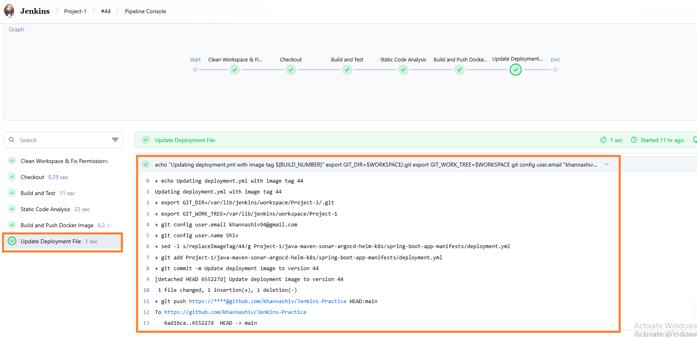
 
 

<!-- Explanation of the 'Update Deployment File' stage .
 
 -- Environment Variables: These are used to build the GitHub push URL later.
    GIT_REPO_NAME = "Jenkins-Practice"
    GIT_USER_NAME = "khannashiv"

-- withCredentials([string(...)]) : credentialsId: 'github', variable: 'GITHUB_TOKEN'
    .. Securely loads your GitHub access token (stored in Jenkins under ID 'github').
    .. It's assigned to the variable GITHUB_TOKEN for use in Git operations.


-- echo "Updating deployment.yml with image tag ${BUILD_NUMBER}" : Logs the current action for visibility.

--  export GIT_DIR=$WORKSPACE/.git
    export GIT_WORK_TREE=$WORKSPACE
     .. Meaning of export : Tells Git where your project is located — this setup is needed if Jenkins doesn’t automatically set it up as a standard Git working tree.

--  git config user.email "khannashiv94@gmail.com"
    git config user.name "Shiv"
    .. Configures Git identity (needed for commits).

-- sed -i "s/replaceImageTag/${BUILD_NUMBER}/g" Project-1/java-maven-sonar-argocd-helm-k8s/spring-boot-app-manifests/deployment.yml
    .. Replaces the placeholder text replaceImageTag in your deployment file with the actual Jenkins build number (e.g., 15).
    .. This essentially updates the image tag to point to the new Docker image you just built.

-- git add Project-1/.../deployment.yml
    .. Stages the modified deployment file for commit.

-- git commit -m "Update deployment image to version ${BUILD_NUMBER}" || echo "Nothing to commit"
    .. Commits the change, or prints a message if nothing was actually changed.

-- git push https://${GITHUB_TOKEN}@github.com/${GIT_USER_NAME}/${GIT_REPO_NAME} HEAD:main || echo "Nothing to push"
    .. Pushes the commit to the main branch on GitHub using your token for authentication.
    .. Falls back to a message if there's nothing to push.


Summary for this stage .
        -- Edits your Kubernetes deployment file to use the latest image.
        -- Commits and pushes that change to GitHub automatically.
        -- This is essential for GitOps workflows, where you want your Git repo to be the single source of truth for deployments.
-->
