## Configuring the Pipeline || Implementation of CI Part .

- **Jenkinsfile**: Add the pipeline script in a file named `Jenkinsfile` at the git repository whose absolute path is Jenkins-Practice/Project-2/python-jenkins-argocd-k8's/JenkinsFile. Below we are explaining each code block which is part of Jenkins pipeine.

    - 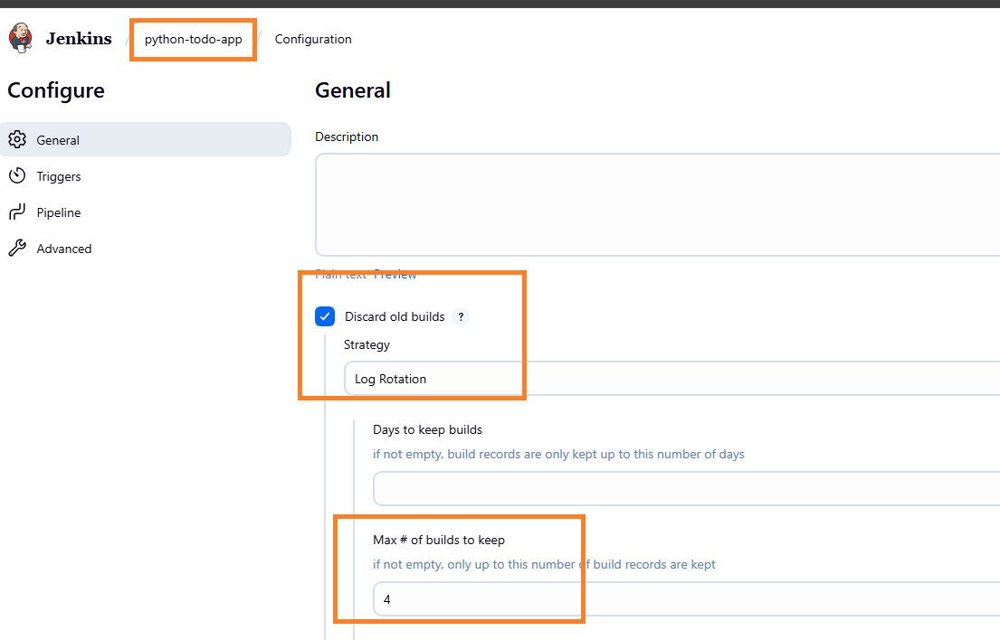
    - 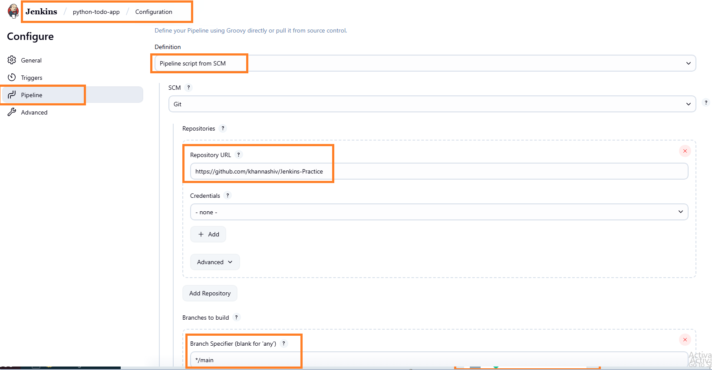
    - 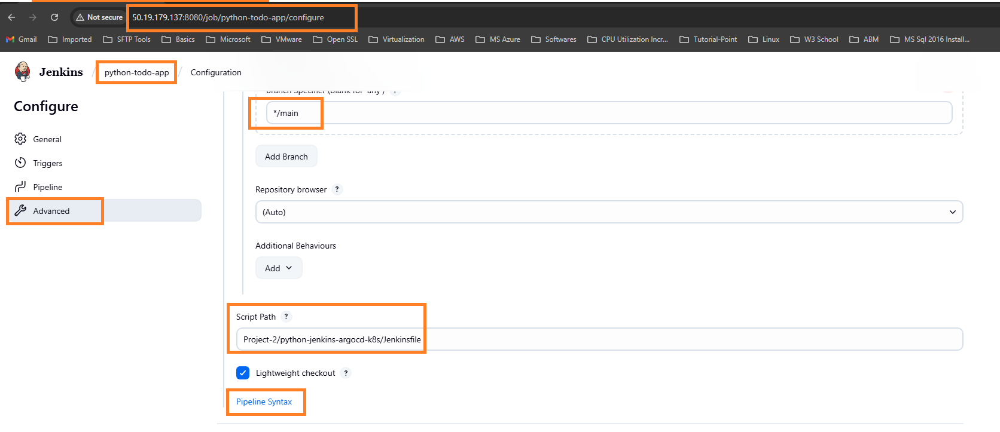
    - 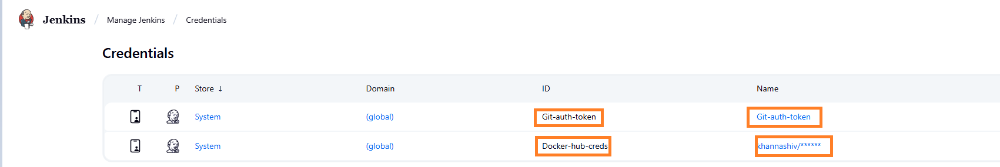
    - 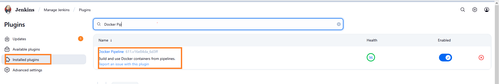

   ```groovy
   pipeline {

        agent any 

        options {
            buildDiscarder(logRotator(numToKeepStr: '4'))
            }
        
        environment {
            IMAGE_TAG = "${BUILD_NUMBER}"
        }
        
   }
   ```

   <!-- Explaination of above code block .
        -- pipeline  : This starts the declarative pipeline block — the top-level container for everything.
        -- agent any : This tells Jenkins to run the pipeline on any available agent (node). If you have a Jenkins cluster, this can run on any worker.
        -- options { buildDiscarder(...) } : This limits how many past builds Jenkins keeps.
            . logRotator(numToKeepStr: '4') : means keep only the last 4 builds, and discard older ones.This is mainly useful for saving disk space.
        -- environment { IMAGE_TAG = "${BUILD_NUMBER}" }
            . This sets an environment variable called IMAGE_TAG to the value of BUILD_NUMBER.
            . BUILD_NUMBER is a built-in Jenkins variable that auto-increments with each pipeline run.
            . IMAGE_TAG could be used later to tag Docker images or version your build artifacts.
   -->

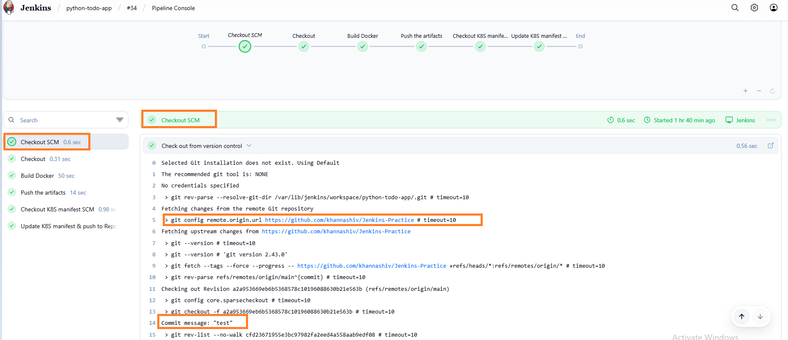

```groovy
   stages {

       stage('Checkout'){
           steps {
                git credentialsId: 'Git-auth-token', 
                url: 'https://github.com/khannashiv/Jenkins-Practice',
                branch: 'main'
           }
        }

           stage('Build Docker'){
            steps{
                script{
                    sh '''
                    echo 'Buid Docker Image'
                    ls -al /var/lib/jenkins/workspace/python-todo-app/
                    pwd
                    docker build -t khannashiv/todoapp:${BUILD_NUMBER} -f Project-2/python-jenkins-argocd-k8s/Dockerfile .
                    '''
                }
            }
        }
   }
   ```

   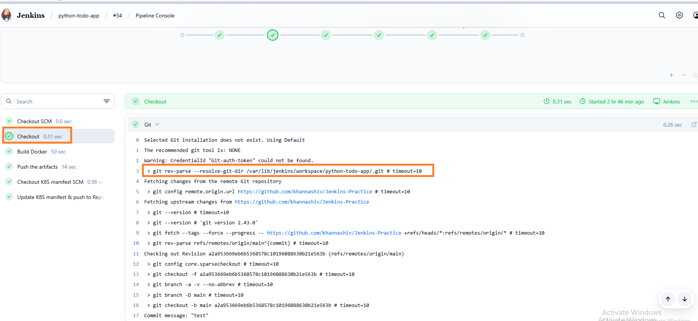
   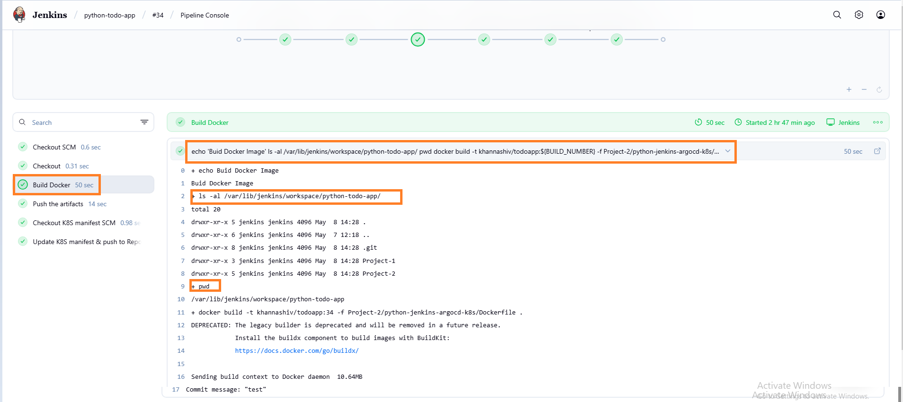
   

   <!-- Explaination of Checkout as well as build stage.

        -- Checking out code" means:
            -- Downloading the latest version of your code from a version control system (like GitHub) to the machine where Jenkins (or any CI/CD tool) will work on it.

        -- Checks out code from the GitHub repository khannashiv/Jenkins-Practice on the main branch.
            -- Uses a stored Git credential (in Jenkins) called 'Git-auth-token' to authenticate (likely a Personal Access Token).
            -- Purpose: Pull the latest code from GitHub so Jenkins can build it.
        -- Stage: Build Docker
            -- Print "Build Docker Image"
            -- List files in the Jenkins workspace (/var/lib/jenkins/workspace/python-todo-app/)
            -- Print the current working directory (pwd)
            -- Build a Docker image using the docker build command.
                -- -t khannashiv/todoapp:${BUILD_NUMBER}: Tags the image with your Docker Hub username (khannashiv) and the Jenkins build number as the version.
                -- -f .../Dockerfile: Specifies the path to the Dockerfile inside your project.
                --  .: Uses the current directory as the build context (all files available to Docker for copying into the image).
                -- Purpose: Automatically create a versioned Docker image of your application from your codebase.
        -- Summary
           -- Your pipeline does the following:
                - Checks out the latest code from your GitHub repo.
                - Builds a Docker image from that code and tags it with the Jenkins build number.
   -->


```groovy
   stages {

       stage('Push the artifacts'){
           steps{
                withCredentials([usernamePassword(credentialsId: 'Docker-hub-creds', usernameVariable: 'DOCKER_USER', passwordVariable: 'DOCKER_PASS')]) {
                script{
                    sh '''
                    echo 'Login to Docker Hub'
                    echo "$DOCKER_PASS" | docker login -u "$DOCKER_USER" --password-stdin

                    echo 'Push to Repo'
                    docker push khannashiv/todoapp:${BUILD_NUMBER}
                    '''
                    }
                }
            }
        }
        
        stage('Checkout K8S manifest SCM'){
            steps {
                git credentialsId: 'Git-auth-token', 
                url: 'https://github.com/khannashiv/CICD-manifests',
                branch: 'main'
            }
        }
   }
   ```

   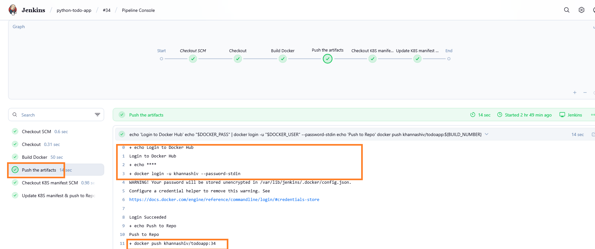
   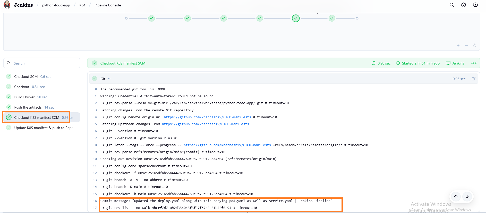
  
   <!-- Explaination of Push as well as Checkout K8S manifest SCM .
    
        -- withCredentials block:
            - Uses a stored Jenkins credential with ID 'Docker-hub-creds'.
            - Maps the username to the shell variable $DOCKER_USER and password to $DOCKER_PASS.
        -- docker login:
            - Authenticates to Docker Hub using those credentials.
            - Uses --password-stdin for secure password input.
        -- docker push:
            -- Pushes the Docker image that we have built earlier (khannashiv/todoapp:${BUILD_NUMBER}) to your Docker Hub repository.
        -- Purpose: Upload your Docker image to Docker Hub so it can be used in deployments.

        -- Stage: Checkout K8S manifest SCM
            -- Pull the Kubernetes manifest repository (CICD-manifests) from GitHub.
            -- Uses Jenkins credentials (Git-auth-token) for access.
            -- Checks out the main branch.
            -- Purpose: Retrieve Kubernetes YAML files (like deployments, services) that will later be used to deploy your app.

        -- Summary
            -- This part of my pipeline:
                - Logs in to Docker Hub and pushes the Docker image.
                - Pulls Kubernetes deployment files from another Git repo, preparing for a Kubernetes deployment (likely in a following stage).
   -->


   ```groovy
   stages {

      stage('Update K8S manifest & push to Repo'){
        environment {
                GIT_REPO_NAME = "CICD-manifests"
                GIT_USER_NAME = "khannashiv"
            }
            steps {
                script{
                    withCredentials([string(credentialsId: 'Git-auth-token', variable: 'GITHUB_TOKEN')]) {
                        sh '''
                            echo "Cloning target repo..."
                            rm -rf target-repo
                            git clone https://${GITHUB_TOKEN}@github.com/${GIT_USER_NAME}/${GIT_REPO_NAME}.git target-repo

                            echo "Cloning source repo (Jenkins-Practice)..."
                            git clone https://github.com/khannashiv/Jenkins-Practice.git src-repo

                            echo "Modifying deploy.yaml in source repo"
                            POD_YAML_PATH="src-repo/Project-2/python-jenkins-argocd-k8s/deploy/pod.yaml"
                            SERVICE_YAML_PATH="src-repo/Project-2/python-jenkins-argocd-k8s/deploy/service.yaml"
                            DEPLOY_YAML_PATH="src-repo/Project-2/python-jenkins-argocd-k8s/deploy/deploy.yaml"

                            sed -i "s/ReplaceImageTag/${BUILD_NUMBER}/g" "$DEPLOY_YAML_PATH"
                            sed -i "s/ReplaceImageTag/${BUILD_NUMBER}/g" "$POD_YAML_PATH"
        

                            echo "Printing the udpated build number for manifest files."
                            cat "$DEPLOY_YAML_PATH"
                            cat "$POD_YAML_PATH"
        

                            echo "Copying updated deploy.yaml to target repo"
                            mkdir -p target-repo/Project-2/python-jenkins-argocd-k8s/deploy
                            cp "$DEPLOY_YAML_PATH" target-repo/Project-2/python-jenkins-argocd-k8s/deploy/
                            cp "$SERVICE_YAML_PATH" target-repo/Project-2/python-jenkins-argocd-k8s/deploy/
                            cp "$POD_YAML_PATH" target-repo/Project-2/python-jenkins-argocd-k8s/deploy/

                            cd target-repo
                            git config user.email "khannashiv94@gmail.com"
                            git config user.name "Shiv"

                            git add Project-2/python-jenkins-argocd-k8s/deploy/*
                            git commit -m "Updated the deploy.yaml along with this copying pod.yaml as well as service.yaml | Jenkins Pipeline" || echo "Nothing to commit"
                            git push origin main || echo "Nothing to push"
                        '''                        
                    }
                }
            }
        }
   }
   ```

 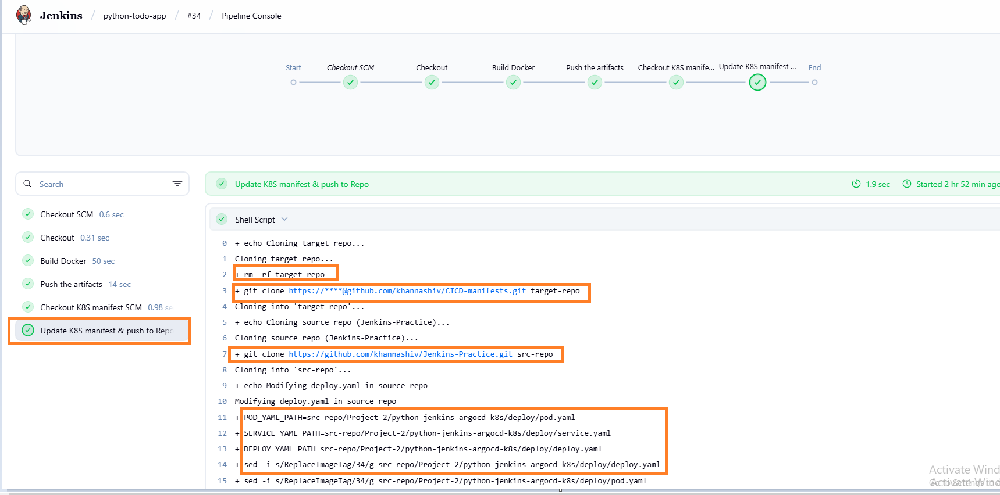
 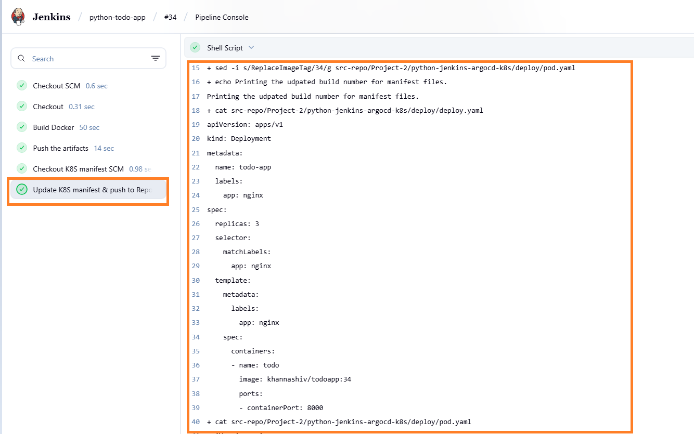
 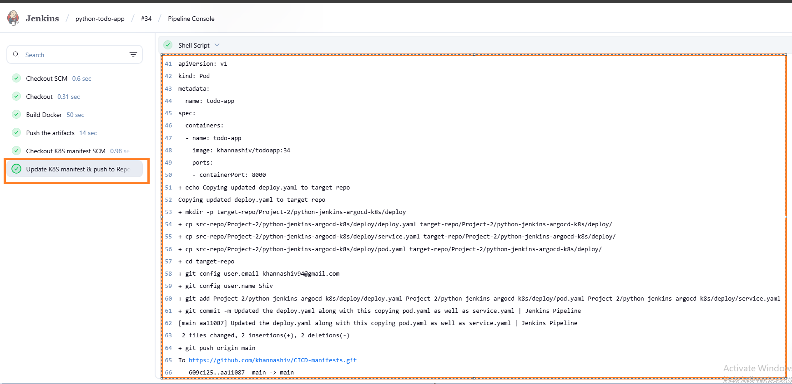

   <!-- Explaination of Update K8S manifest & push to Repo
        
        NOTE : This git repository i.e. https://github.com/khannashiv/CICD-manifests initially is empty i.e. it is not holding any manifest files.

        -- This Jenkins pipeline stage automates the process of updating Kubernetes manifest files with the current build number, then pushing those updated files to a GitHub repo used for Kubernetes deployments.

        -- Stage: Update K8S manifest & push to Repo .
            -- Goal : Update image tags in YAML files (used for Kubernetes deployment) with the latest build number, and push those changes to the CICD-manifests GitHub repository.

        -- environment { ... } : Sets two environment variables:
               -- GIT_REPO_NAME: Name of the target GitHub repo (where updated files will be pushed) .
               -- GIT_USER_NAME: GitHub username used in the Git clone URL .

        -- withCredentials(...) : Uses a GitHub token (from Jenkins credentials) to authenticate private repo access securely.

        -- sh ''' ... '''  :  Shell script block

        -- Clone Target Repo (Where changes will be pushed):
            - git clone https://${GITHUB_TOKEN}@github.com/${GIT_USER_NAME}/${GIT_REPO_NAME}.git target-repo : Downloads the CICD-manifests repo into a folder named target-repo.

        -- Clone Source Repo (Where the original YAML files are): 
            - git clone https://github.com/khannashiv/Jenkins-Practice.git src-repo : Clones your Jenkins-Practice repo into src-repo — this repo contains the original deploy.yaml, pod.yaml, and service.yaml files.

        -- Modify the YAML files: sed -i "s/ReplaceImageTag/${BUILD_NUMBER}/g" "$DEPLOY_YAML_PATH"
            - Replaces the placeholder ReplaceImageTag in your YAML files with the actual Jenkins build number — this ensures the new Docker image version is used in the Kubernetes deployment.

        -- Print updated YAML files: Useful for debugging; prints the new content to the Jenkins log.

        -- Copy updated YAML files into the target repo: These updated files are copied to the correct location inside the target-repo directory, preparing them for commit.

        -- Commit and push the changes:
            -- git add ...
            -- git commit ...
            -- git push origin main
                - Pushes the updated Kubernetes manifests back to the GitHub repo (CICD-manifests), so that: They reflect the new Docker image version .

        Summary

                -- This stage automates versioning of your Kubernetes deployment files by doing following steps .
                        - Inserting the current build number
                        - Committing those updates
                        - Pushing them to a GitHub repo used for Kubernetes deployment
    -->


## Here we have completed CI (Continous integration) part from implementation prospective & we are going to implement CD (Continous delivery) part .

**For CD process we have followed same steps as implemented for spring boot application whose repository path is : https://github.com/khannashiv/Jenkins-Practice/blob/main/Project-1/java-maven-sonar-argocd-helm-k8s/Implementation.md**

<!--
 - We are attaching final outcomes of python application deployed via ArgoCD .
-->

 - 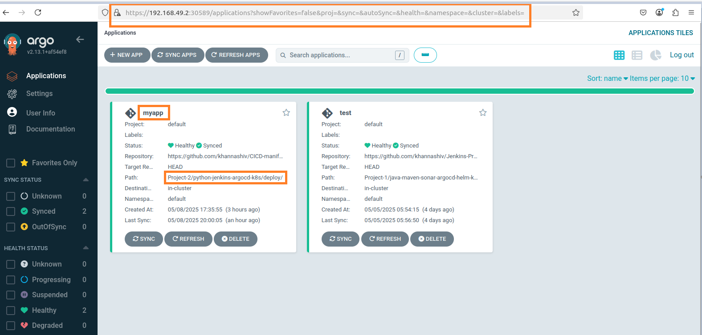
 - 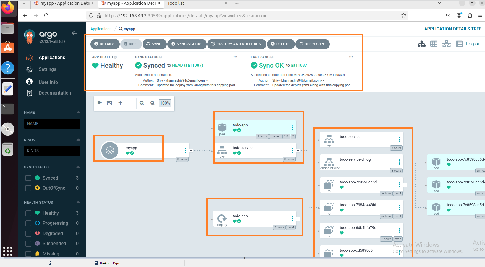
 - 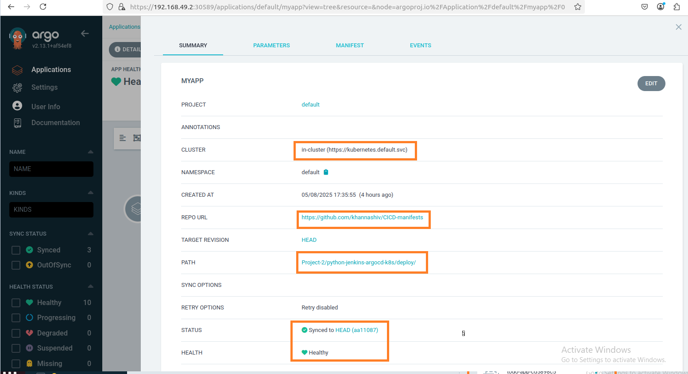
 - 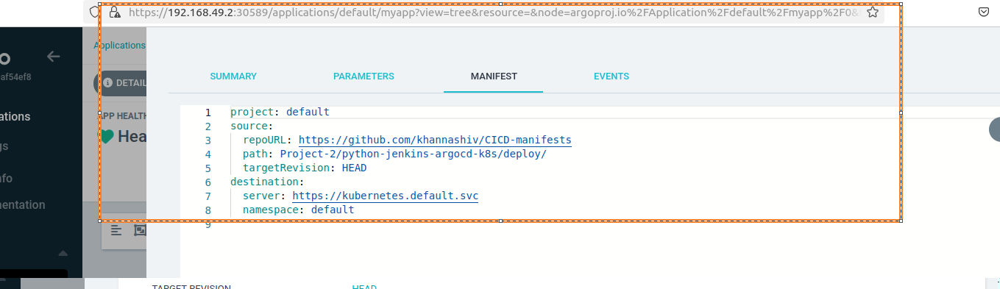
 - 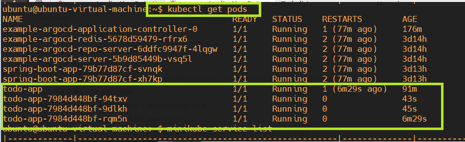
 - 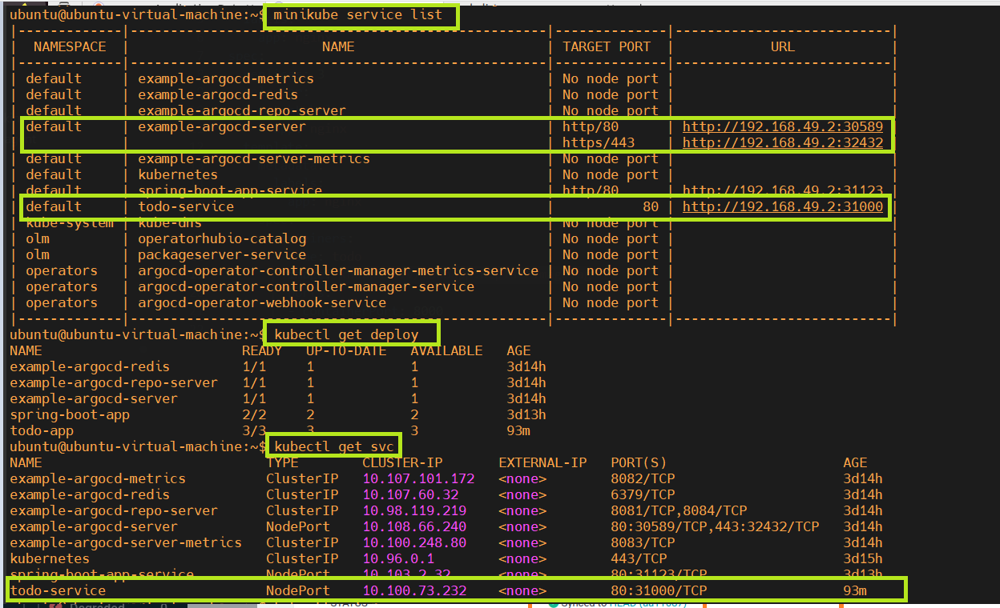
 - 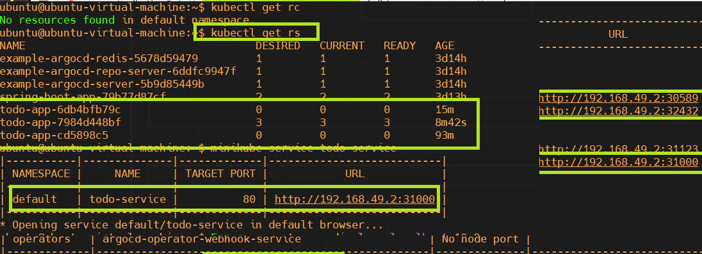
