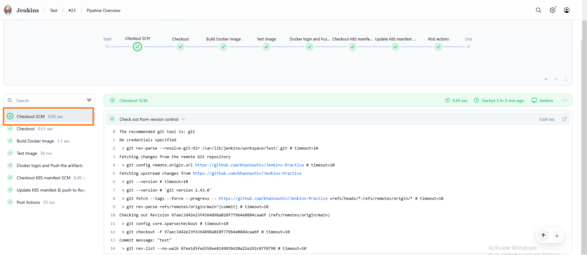
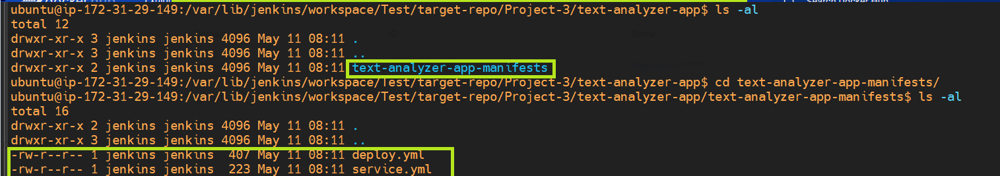

## Setting Up Jenkins

1. **Install Jenkins**:
   - Set up a Jenkins server on an EC2 instance (e.g., t2.large if one is installaing sonarqube as well else if you are skipping sonarqube stage in that case t2.micro is suffice).
   - Use the following command to retrieve the initial admin password:
     ```bash
     cat /var/lib/jenkins/secrets/initialAdminPassword
     ```

2. **Log into Jenkins**:
   - Navigate to the Jenkins admin page.
   - Enter the username `Jenkins` and the password retrieved in Step 1.

3. **Create a New Pipeline**:
   - Click on "New Item" on the Jenkins home page.
   - Select "Pipeline" as the project type.

4. **Configure the Pipeline**:
   - Add a general description.
   - Set up the "Discard old builds" section.
   - Define the pipeline:
     - **SCM**: Git
     - **Repository URL**: `https://github.com/khannashiv/Jenkins-Practice`
     - **Branches to build**: Specify the branch name.
     - **Script Path**: Path to your `Jenkinsfile`.
     - Add required plugins such as **Git plugin**, **Docker pipeline**, **SonarQube Scanner** used in this project.
     - Configure credentials for **Git**, **SonarQube**, and **Docker** for authentication purposes.

    - 
    - 
    - 
    - 
    - 
    - 
    - 

## Configuring the Pipeline

- **Jenkinsfile**: Add the pipeline script in a file named `Jenkinsfile` at the git repository whose absolute path is Jenkins-Practice/Project-3/text-analyzer-app/Jenkinsfile. Below we are explaining each code block which is part of Jenkins pipeine.

   ```groovy
        agent any
   ```

<!-- Explanation of the agent block above:
    
 -- agent specifies where the pipeline or a stage runs (which machine or environment).
 -- any tells Jenkins:
        ➤ "Use any available executor on any available agent (including the master, if allowed).”
 -- You can also be more specific:
        > agent none                 – Use this if you'll specify agents per stage.
        > agent { label 'linux' }    – Run only on agents labeled linux.
        > agent { docker 'node:14' } – Run in a Docker container using node:14. In other words it says i.e. Run the pipeline (or stage) inside a Docker container that uses the node:14 image.
        > for example i.e.

        pipeline {
                agent {
                    docker 'node:14'
                }
                stages {
                    stage('Build') {
                        steps {
                            sh 'node -v'
                            sh 'npm install'
                        }
                    }
                }
            }

-->

   ```groovy
   options {
       buildDiscarder(logRotator(numToKeepStr: '2'))
   }
   ```

<!-- Explanation of the options block mentioned above .

- `buildDiscarder(logRotator(numToKeepStr: '2'))`: Configures Jenkins to retain only the last 2 builds, automatically discarding older build logs to save disk space.
- buildDiscarder(logRotator(...)) is built-in features provided by Jenkins for use in Declarative Pipelines.

-->

``` groovy

   environment {
        DOCKERHUB_USER = 'khannashiv'
        IMAGE_NAME     = 'text-analyzer'
        IMAGE_TAG      = "${BUILD_NUMBER}"
        IMAGE_FULL     = "${DOCKERHUB_USER}/${IMAGE_NAME}:${IMAGE_TAG}"
    }

```

<!-- Explanation of environment block mentioned above .
  
  -- The environment block provided is defining environment variables for my Jenkins pipeline, which can be used throughout my build steps .
        - DOCKERHUB_USER: My Docker Hub username (khannashiv).
        - IMAGE_NAME: The name that we want for our Docker image (text-analyzer).
    - IMAGE_TAG: The tag/version of the image. we're using ${BUILD_NUMBER}, which Jenkins automatically provides (e.g., #1,     #2, etc.).
        - IMAGE_FULL: Combines all of the above into a full Docker image reference, like: khannashiv/text-analyzer:5

-->

   ```groovy
   stages {
        stage('Checkout') {
            steps {
                git credentialsId: 'GitHub-auth-creds',
                url: 'https://github.com/khannashiv/Jenkins-Practice.git',
                branch: 'main'
            }
        }

        stage('Build Docker Image') {
            steps {
                script {
                    sh '''
                    echo 'Buid Docker Image'
                    ls -al /var/lib/jenkins/workspace/Test/Project-3/text-analyzer-app/
                    pwd
                    docker build -t $IMAGE_FULL -f Project-3/text-analyzer-app/Dockerfile Project-3/text-analyzer-app
                    '''
                }
            }
        }
   }
   ```
  


<!-- Explanation of the 'Checkout and build docker image' stage:

Here we have two stages from a Jenkins declarative pipeline:

        -- Checkout Stage: Checks out code from GitHub.
            What it does:
                > Clones the main branch of the given GitHub repo.
                > Uses stored Jenkins credentials (GitHub-auth-creds) for authentication.
        -- Build Docker Image Stage: Builds a Docker image using a Dockerfile from your project.
                > Uses Dockerfile located at: Project-3/text-analyzer-app/Dockerfile .
                > Build context is: Project-3/text-analyzer-app .
                > Tags the image using the environment variable $IMAGE_FULL .
-->

   ```groovy
   stages {
           stage('Docker login and Push the artifacts'){
                steps{
                        withCredentials([usernamePassword(credentialsId: 'dockerhub-creds', usernameVariable: 'DOCKERHUB_USER', passwordVariable: 'DOCKER_PASS')]) {
                        script{
                            sh '''
                            echo 'Login to Docker Hub'
                            echo "$DOCKER_PASS" | docker login -u "$DOCKERHUB_USER" --password-stdin

                            echo 'Push to Repo'
                            docker push $IMAGE_FULL
                            '''
                        }
                    }
                }
            }
        }
   ```

     
   
   

<!-- Explanation of 'Docker login and Push the artifacts' stage .

    -- withCredentials(...) : Securely injects Docker Hub username and password from Jenkins credentials (ID: dockerhub-creds).Makes them available in shell as DOCKERHUB_USER and DOCKER_PASS.
    -- docker login : Logs into Docker Hub securely using the password from the Jenkins credential (via --password-stdin).
    -- docker push $IMAGE_FULL : Pushes the previously built image (ex : khannashiv/text-analyzer:5) to Docker Hub.

-->

 ```groovy
     stages {
        stage('Checkout K8S manifest SCM'){
            steps {
                git credentialsId: 'GitHub-auth-creds', 
                url: 'https://github.com/khannashiv/CICD-manifests',
                branch: 'main'
            }
        }
     }
```

   
   

   
   

<!-- Explanation of 'Checkout K8S manifest SCM' stage .

    -- git: Jenkins built-in step to check out code from Git.
    -- credentialsId: Uses stored credentials for authenticated access to a private repo (or personal access token if needed).
    -- url: Your GitHub repo where the Kubernetes YAMLs or Helm charts are stored.
    -- branch: Checks out the main branch.
    This is useful when : 
       -- We're maintaining Kubernetes manifests separately from your application code / repository.
       -- We want to deploy the latest manifests as part of the pipeline (e.g., with kubectl apply or Helm).
-->


 ```groovy
   stages {

      stage('Update K8S manifest & push to Repo'){
        environment {
                GIT_REPO_NAME = "CICD-manifests"
                GIT_USER_NAME = "khannashiv"
            }
            steps {
                script{
                    withCredentials([string(credentialsId: 'GitHub-auth-creds', variable: 'GITHUB_TOKEN')]) {
                        sh '''
                            echo "Cloning target repo..."
                            rm -rf target-repo
                            git clone https://${GITHUB_TOKEN}@github.com/${GIT_USER_NAME}/${GIT_REPO_NAME}.git target-repo

                            echo "Cloning source repo (Jenkins-Practice)..."
                            rm -rf src-repo
                            git clone https://github.com/khannashiv/Jenkins-Practice.git src-repo

                            echo "Modifying deploy.yaml in source repo"

                            SERVICE_YAML_PATH="src-repo/Project-3/text-analyzer-app/text-analyzer-app-manifests/service.yml"
                            DEPLOY_YAML_PATH="src-repo/Project-3/text-analyzer-app/text-analyzer-app-manifests/deploy.yml"

                            sed -i "s/ReplaceImageTag/${BUILD_NUMBER}/g" "$DEPLOY_YAML_PATH"

                            echo "Printing the udpated build number for manifest files."
                            cat "$DEPLOY_YAML_PATH"

                            echo "Copying updated deploy.yaml to target repo"
                            mkdir -p target-repo/Project-3/text-analyzer-app/text-analyzer-app-manifests
                            cp "$DEPLOY_YAML_PATH" target-repo/Project-3/text-analyzer-app/text-analyzer-app-manifests/
                            cp "$SERVICE_YAML_PATH" target-repo/Project-3/text-analyzer-app/text-analyzer-app-manifests/

                            cd target-repo
                            git config user.email "khannashiv94@gmail.com"
                            git config user.name "Shiv"

                            git add Project-3/text-analyzer-app/text-analyzer-app-manifests/*
                            git commit -m "Updated the deploy.yaml along with this copying pod.yaml as well as service.yaml | Jenkins Pipeline" || echo "Nothing to commit"
                            git push origin main || echo "Nothing to push"
                        '''                        
                    }
                }
            }
        }
   }
   ```

  
  
  
 
  
  
  

 
  
  

  <!-- Explaination of Update K8S manifest & push to Repo
        
        NOTE : This git repository i.e. https://github.com/khannashiv/CICD-manifests initially is empty i.e. it is not holding any manifest files. Also src repo as well as target repo these are directories will get created on Jenkins node /agent on the host VM. These are kind of temporary directory or we can call it placeholder directory which will holds respective data which falls under it after cloning the repository .These are only seen on the VM which is my Jenkins worker node in this case .These ( src-repo and target-repo folders ) will not be visible inside git.
         
        -- This Jenkins pipeline stage automates the process of updating Kubernetes manifest files with the current build number, then pushing those updated files to a GitHub repo used for Kubernetes deployments.

        -- Stage: Update K8S manifest & push to Repo .
            -- Goal : Update image tags in YAML files (used for Kubernetes deployment) with the latest build number, and push those changes to the CICD-manifests GitHub repository.

        -- environment { ... } : Sets two environment variables:
            -- GIT_REPO_NAME: Name of the target GitHub repo (where updated files will be pushed) .
            -- GIT_USER_NAME: GitHub username used in the Git clone URL .

        -- withCredentials(...) : Uses a GitHub token (from Jenkins credentials) to authenticate private repo access securely.

        -- sh ''' ... '''  :  Shell script block

        -- Clone Target Repo (Where changes will be pushed):
            - git clone https://${GITHUB_TOKEN}@github.com/${GIT_USER_NAME}/${GIT_REPO_NAME}.git target-repo : Downloads the CICD-manifests repo into a folder named target-repo.

        -- Clone Source Repo (Where the original YAML files are): 
            - git clone https://github.com/khannashiv/Jenkins-Practice.git src-repo : Clones your Jenkins-Practice repo into src-repo — this repo contains the original deploy.yaml, pod.yaml, and service.yaml files.

        -- Modify the YAML files: sed -i "s/ReplaceImageTag/${BUILD_NUMBER}/g" "$DEPLOY_YAML_PATH"
            - Replaces the placeholder ReplaceImageTag in your YAML files with the actual Jenkins build number — this ensures the new Docker image version is used in the Kubernetes deployment.

        -- Print updated YAML files: Useful for debugging; prints the new content to the Jenkins log.

        -- Copy updated YAML files into the target repo: These updated files are copied to the correct location inside the target-repo directory, preparing them for commit.

        -- Commit and push the changes:
            -- git add ...
            -- git commit ...
            -- git push origin main
                - Pushes the updated Kubernetes manifests back to the GitHub repo (CICD-manifests), so that: They reflect the new Docker image version .

        Summary
                -- This stage automates versioning of your Kubernetes deployment files by doing following steps .
                        - Inserting the current build number
                        - Committing those updates
                        - Pushing them to a GitHub repo used for Kubernetes deployment
    -->

## Here we have completed CI part from implementation prospective & we are going to implement CD part .

1. **Install MiniKube** :

    - For this I have deployed ubuntu machine On premises . On top of it I have installed minikube cluster by following the documentation as follows as per my OS which in this case is ubuntu
    - OS configuration
        - RAM : 16GB
        - Processor : 8
        - Disk : 80 GB
        - Since in my case initially minikube fails to start, hence I have to install drivers for linux distribution where I have used docker container based approach & following links have been attached from installation standpoint.
    - Refrences .
        - https://minikube.sigs.k8s.io/docs/start/?arch=%2Flinux%2Fx86-64%2Fstable%2Fbinary+download
        - https://minikube.sigs.k8s.io/docs/drivers/
        - https://minikube.sigs.k8s.io/docs/drivers/docker/

    - Some basic minikube commands.

    - Starting, Stopping, and Managing the Cluster

        | Command            | Description                                                  |
        | ------------------ | ------------------------------------------------------------ |
        | `minikube start`   | Starts a Minikube cluster (creates one if it doesn't exist). |
        | `minikube stop`    | Stops the Minikube cluster.                                  |
        | `minikube delete`  | Deletes the Minikube cluster completely.                     |
        | `minikube status`  | Shows the current status of the Minikube cluster.            |
        | `minikube restart` | Restarts the Minikube cluster.                               |
        | `minikube docker-env`	 | Shows how to use Minikube’s Docker daemon.               |

    - Working with Add-ons

    | Command                                | Description                                                         |
    | -------------------------------------- | ------------------------------------------------------------------- |
    | `minikube addons list`                 | Lists all available and enabled add-ons.                            |
    | `minikube addons enable <addon-name>`  | Enables an add-on (e.g., `dashboard`, `metrics-server`, `ingress`). |
    | `minikube addons disable <addon-name>` | Disables an add-on.                                                 |

    - Accessing Services

    | Command                           | Description                                                  |
    | --------------------------------- | ------------------------------------------------------------ |
    | `minikube service <service-name>` | Opens a service in your default browser.                     |
    | `minikube service list`           | Lists URLs for services with NodePort or LoadBalancer types. |
    | `minikube tunnel`                 | Enables LoadBalancer-type services to work locally.          |

    - Working with the VM or Container

    | Command                                | Description                                   |
    | -------------------------------------- | --------------------------------------------- |
    | `minikube ssh`                         | SSH into the Minikube VM/container.           |
    | `minikube mount <host-path>:<vm-path>` | Mounts a host directory into the Minikube VM. |


2. **Install ArgoCD via operator** :

    - Once our K8's cluster was ready, we further have done installation of ArgoCD using operator approach.
    - For which we have followed official documentation for installing operators i.e. https://operatorhub.io/operator/argocd-operator
        - Commands used for installtion & to verify if operators / pods deployed successfully or not.
         -  curl -sL https://github.com/operator-framework/operator-lifecycle-manager/releases/download/v0.31.0/install.sh | bash -s v0.31.0
         - kubectl create -f https://operatorhub.io/install/argocd-operator.yaml
         - kubectl get pods -n operators
         - kubectl get pods -n operators -w
         - kubectl get nodes -o wide

         - Some basic Kubectl commands .

            - Cluster Info & Configuration

                | Command                | Description                       |
                | ---------------------- | --------------------------------- |
                | `kubectl version`      | Shows client and server versions. |
                | `kubectl cluster-info` | Displays cluster endpoint URLs.   |
                | `kubectl config view`  | Shows kubeconfig file details.    |
                | `kubectl get nodes`    | Lists all nodes in the cluster.   |  

            - Working with Resources .

                | Command                   | Description                                                              |
                | ------------------------- | ------------------------------------------------------------------------ |
                | `kubectl get pods`        | Lists all pods in the current namespace.                                 |
                | `kubectl get pods -A`     | Lists all pods in **all namespaces**.                                    |
                | `kubectl get deployments` | Lists all deployments.                                                   |
                | `kubectl get services`    | Lists all services (ClusterIP, NodePort, etc.).                          |
                | `kubectl get all`         | Lists **all** common resource types (pods, services, deployments, etc.). |

            - Create & Apply Resources

                | Command                         | Description                                     |
                | ------------------------------- | ----------------------------------------------- |
                | `kubectl apply -f <file.yaml>`  | Applies a manifest (creates or updates).        |
                | `kubectl create -f <file.yaml>` | Strictly creates a resource from the YAML file. |
                | `kubectl delete -f <file.yaml>` | Deletes a resource defined in the YAML.         |
                | `kubectl delete pod <pod-name>` | Deletes a specific pod.                         |

            - Namespaces

            | Command                                                        | Description                                             |
            | -------------------------------------------------------------- | ------------------------------------------------------- |
            | `kubectl get namespaces`                                       | Lists all namespaces.                                   |
            | `kubectl get pods -n <namespace>`                              | Lists pods in a specific namespace.                     |
            | `kubectl config set-context --current --namespace=<namespace>` | Changes the default namespace for your current context. |


            - Inspecting & Debugging

                | Command                                       | Description                                                       |
                | --------------------------------------------- | ----------------------------------------------------------------- |
                | `kubectl describe pod <pod-name>`             | Shows detailed info about a pod (events, container status, etc.). |
                | `kubectl logs <pod-name>`                     | Shows logs from a pod's main container.                           |
                | `kubectl logs <pod-name> -c <container-name>` | Logs from a specific container in a multi-container pod.          |
                | `kubectl exec -it <pod-name> -- bash`         | Executes an interactive shell in the pod (if bash is available).  |
                | `kubectl get events`                          | Shows recent events (warnings, info).                             |

3. **Creating ArgoCD controller** :

    - Create a new yml file say by the name of : vim argocd-basic.yml
    - Copy the content in the above yaml file as mentioned in the below documentation.
    - Refrence docs : https://argocd-operator.readthedocs.io/en/latest/usage/basics/ 
    - After this run command i.e.  kubectl apply -f argocd-basic.yml and wait for argocd pods to get deployed under default namespace.
    - Once pods are ready go to the services such that : kubectl get svc & look for example-argocd-server and by default the type of service will be ClusterIP.
    - We will go ahead & convert this to NodePort so that we can login to ArgoCD via browser since this service is responsible for ArgoCD UI . So we will run command i.e. kubectl edit svc example-argocd-server ( This may not work due to ownerReferences section hence follow below steps to change service type.)

        - kubectl get argocd -A
        - kubectl edit argocd example-argocd -n default
        - Search for the server section and see if you can define.Further Update the service type to NodePort from ClusterIP & then save and check the service .
                spec:
                    server:
                        service:
                            type: NodePort
    - Further we will generate the URL, so that we can access AgroCD over a web browser. For this we will use command i.e. 
        - minikube service list
        - minikube service example-argocd-server

    - Next to login to ArgoCD, we have user-name as admin & password we have to pull from secret section of argocd cluster i.e. example-argocd-cluster
        - Commands used are .
            - kubectl get secret
            - kubectl edit secret example-argocd-cluster
            -  echo <XXXXXX> | base64 -d        # Decode password using base64 conversion.
            - Finally we will able to login to admin page of ArgoCD.

4. **Final application deployed via ArgoCD**

- Further we have created an application on ArgoCD UI where we have mentioned following details i.e.

    - CLUSTER   : https://kubernetes.default.svc
    - NAMESPACE : default
    - REPO URL  : https://github.com/khannashiv/Jenkins-Practice 
    - PATH      : To manifest files i.e. Project-1/text-analyzer-app/text-analyzer-app-manifests 
    - Finally we can see our application running on top of pods got deployed sucessfully after configuring ArgoCD.
        - kubectl get pods
        - kubectl get deploy
        - kubectl get svc
        - minikube service list
        - We can see minikube has alloted 1 more URL to application i.e. using which we can load app on top of browser .

            default     | text-analyzer-app-service         | http/80      | http://192.168.49.2:31001


 - 
 - 
 - 
 - 
 - 
 - 
 - 
 - 
 - 
 - 
 - 
 - 
